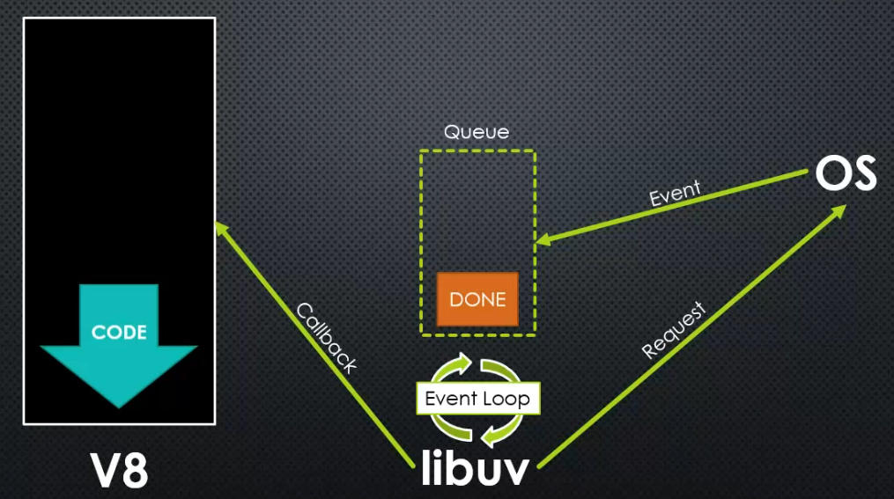

<h1>NodeJS Tutorial</h1>

Node is written in C++. V8 is written in C++. V8 is embedded into Node.js. There are hooks that can be
used to add features into Javascript inside of V8. You add a definition into the V8 C++ code and it
becomes available in Javascript. Or rather, the call that you have in Javascript will have a definition
in the compiling C++ code.

Ecmascript is a language specification, while JS is the implementation. V8 makes sure the JS compiled 
machine code works according to specification. V8 is a Javascript engine. A Javascript engine is a 
program that converts Javascript code into something the computer processor can understand. And it 
should follow the ECMAScript standard on how the language should work and what features it should have.

What does Javascript need to manage a server?
* Better ways to organize our code into reusable parts (Modules)
* Ways to deal with files (Node C++ additions and streams)
* Ways to deal with databases
* The ability to communicate over the Internet (startServer request, response)
* The ability to accept requests and send responses (startServer request, response)
* A way to deal with work that takes a long time (Streams)

The above problems are issues that Javascript doesn't solve. At least not in vanilla. Node, however, does.

Node comes with a lot of utility JS files that are mainly wrappers for C++ code. Some are pure JS.

You can enter a Node REPL environment by writing `node` into the command line.

Can run your own files with `node <file-name>`.

The main file is often named `app.js` or `server.js`.

CommonJS modules are an agreed upon standard for how code modules should be structured.

Each time you `require` a module, it's being run through Node, as you'd expect. What it does,
however, is add additional features to it. It creates a wrapper around the code that
you've written and adds additional properties to the code that you can access. It adds
`exports`, `require`, `module`, `__filename`, `__dirname`. At the end of the module
execution `module.exports` is returned.

The actual code looks like this.

```
...

(function (exports, require, module, __filename, __dirname) {
    function greet() {
        console.log('Hello');
    }
    
    module.exports = greet;
});

...

fn (module.exports, require, module, filename, dirname);

...

return module.exports; 

```

`exports` is the same object as `module.exports`. However, the same export patterns do not work with
`exports` as it does with `module.exports`. You can easily see the problem when looking at the code
pattern of how our code is being wrapped in the above code section. If you do `exports = ...` then it
won't work, because you're changing the object value inside a function and that doesn't work. It's just
better to use `module.exports` instead of `exports` to avoid potential pitfalls.

Event - something that has happened in our app that we can respond to. In Node we actually talk about two
different kinds of events. One of the events come from system events. These are coming from the Node C++
Core from libuv. E.g. I finished reading a file. Things that Javascript doesn't have. The second set of
events are the custom events that are coming from the Javascript core. This is coming from an Event Emitter.
So C++ libuv and JS Core event emitter are the two event types. A lot of the times JS wraps libuv. 

However, JS doesn't actually have the concept of events, though, so the library's faking events. The inner
structure of these is like the code in our `emitter.js`. The actual code is a lot more complex and safer,
though.

Inside of Node we have the V8 engine. V8 is synchronous. Inside of Node we have libuv, that's made to
handle events on the lower level in the operating system. It contains a queue and event loop. The OS puts
a finished event into the queue for the event loop to handle. The loop allows for libuv to constantly 
check the queue if anything has finished. If libuv sees that something has completed, then it processes
the event by calling a callback that's passed from V8.



Buffer - a temporary holding spot for data being moved from one place to another. Intentionally limited
in size.

Stream - a sequence of data made available over time. Pieces of data that eventually combine into a whole.

Buffers and streams are often combined. Data from a stream is collected into a buffer, then processed. 
Then another chunk comes into the buffer and repeat.

A buffer turns the data into binary. When printing it out, then it'll be in hexadecimal
notation for easier reading. We have buffers because regular JS used to not have ways 
of dealing with raw binary data, but with ES6 it has appeared.

Chunk - a piece of data being sent through a stream. Data is split in chunks and streamed.

A lot of elements inside of Node are built on event emitters. Stream is one of those
things. Stream has a bunch of subtypes that serve different purposes. Readable, writable etc.
Their readability or writability is from Node's perspective. A stream directed from the
browser to the server is of type readable, while the response directed from the Node
server to the browser is writable.

Pipe - connecting two streams by writing to one stream what is being read from another.
In Node you pipe from a Readable stream to a Writable stream.

We should always aim to use a stream, so as to minimize the amount of memory our application
is using. Always tend towards asynchronous and streams.

Data is transferred in packets and Node chooses to interpret that as a stream. 

`server.listen()` enters an event loop. The event loop continues existing until an exit occurs by a 
hard exit or some other method. `process.exit()` can be used to exit the event loop, but you wouldn't 
really call it from your code.

When you run your Node app, then your code gets translated into machine code. If you 
make changes, then you have to reboot, because the code hasn't been compiled into new
machine code.

Serialize - translating an object into a format that can be stored or transferred. 
JSON, CSV, XML, and others are popular. 'Deserialize' is the opposite (converting
the format back into an object).

Semantic versioning follows the pattern MAJOR.MINOR.PATCH (1.7.2). 
* (PATCH) You increment the patch number if some bugs were fixed. The code will 
  work fine.
* (MINOR) You increment the minor number if some new features were added. The code
will work fine
* (MAJOR) Big changes. Your code may break.

When using npm, then a caret (^) means that npm will automatically install a higher
minor/patch version when they come out. Tilde (~) means that only patch versions will
be automatically installed.

Middleware - code that sits between two layers of software. In the case of Express,
sitting between the request and the response.

Router can be used to nest routes.

To connect to a DB, first find a driver for your specific database.

The URLs work in the order that you define them. If you have clashing URLs, then the
first one that is defined will be used. So for example `shop/:shopId` and `shop/cart`.
The one without the ID has to be defined first, so that the clash would be solved in
the correct order, otherwise the URL with the ID will be matched instead.

Cookies can be set using `req.setHeader('Set-Cookie', 'whateverKey=whateverValue');`
Cookies can be edited by users, however, so choose wisely what you put into it. Usually
it should just hold the session hash. It's hashed with a secret key that's setup on the
backend side.

You can add a middleware for authentication. You can chain multiple middleware in your routes.
So for example `router.get('/add-product', isAuthenticated, isAllowed, getAddProduct);`

`res.locals` is a group of parameters that exist only on the views that are rendered.

`express-validator` can be used for validation. `validationResult`, that's imported, can be
used to access the validation errors. You add the checks as middleware to the router endpoint.
Async validation can be used by returning a promise.

If you use `next()` with an error, then the error will go to an error handling middleware. It's
a middleware with 4 arguments. If you have several, then the first come, first served model applies
to them as well. If you throw an error outside a promise, then you don't have to use `next()`, if
inside, then you do in order for the error to reach the error handling middleware.

`multer` can be used to process sent files. `multipart/form-data` specifies that a form contains mixed
data - binary and text.

`res.status(200).json()` to send back a JSON response.

CORS errors can only be solved on the server, not on the client side. Use a middleware to help
with CORS. `res.setHeader('Access-Control-Allow-Origin', 'some.url.com');` to lock down to a specific URL.
`res.setHeader('Access-Control-Allow-Methods', 'GET, POST, PUT, PATCH, DELETE');` to allow only certain
HTTP verbs. `res.setHeader('Access-Control-Allow-Headers', 'Content-Type, Authorization');` to allow only
certain headers.

async/awaits allows writing asynchronous requests in a synchronous way. It looks synchronous, but isn't
in how it behaves. It isn't blocking for the main thread.

socket.io can be used to work with websockets in an easier manner. You have to subscribe to the socket.
Then you'll start listening for events on a channel. `io.on('someChannel', {someProperty: 'someValue'});`.
An alternative library could be `express-ws`.

GraphQL can be used to partially query data from the backend. You have a resolver and then a schema.
The schema defines the model, while the resolver actually makes it work. Essentially GraphQL filters
the object down to a smaller form so less data is passed over the wire. Most of the time, you don't
need the same amount of fields in different queries, so it helps limit the amount of pointless overhead
with each query. OPTIONS query can cause issues with GraphQL so need to handle OPTIONS separately.

Remember to set the production flag to true in the process environments to make sure the app gets
optimized for production. Helmet is a useful middleware to add for security. Morgan can be used for
logging requests.

Node cannot run TS code, so you have to compile it to JS first.